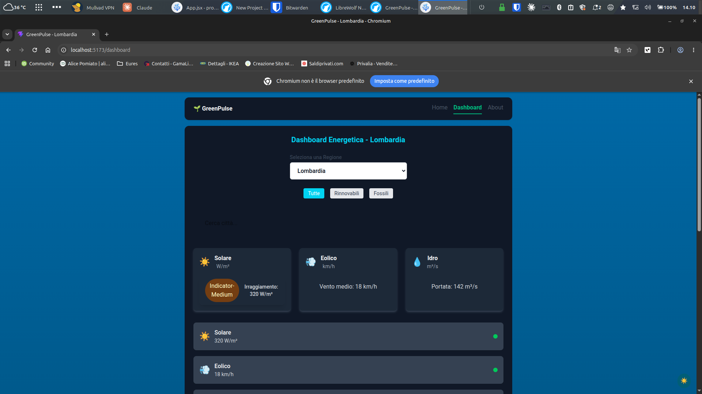
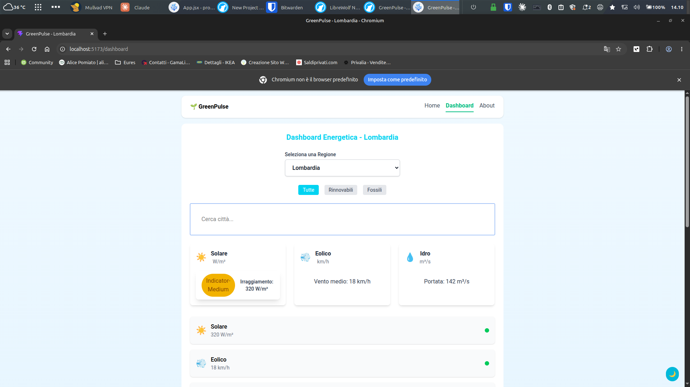

# GreenPulse Italia 🌱





## Demo live
[(https://green-pulse-italia.vercel.app/)]

## Cosa fa
GreenPulse Italia è una dashboard che visualizza il mix energetico
italiano in tempo reale — irraggiamento solare per città, intensità CO₂,
fonti rinnovabili e fossili per regione. Mostra quando l'energia è più
verde e da quale fonte proviene.

## Funzionalità
- Dati irraggiamento solare in tempo reale da Open-Meteo API (per città)
- Filtro regione con persistenza localStorage
- Ricerca città con autocomplete nella Dashboard (20 città italiane con coordinate)
- Filtro per tipo di fonte energetica (rinnovabile / fossile)
- Grafici interattivi: irraggiamento solare, intensità CO₂, produzione settimanale
- Dark mode completa
- Routing multi-pagina con React Router v6
- Form di ricerca con validazione (React Hook Form)

## Stack tecnico
React 18 · Vite · Tailwind CSS · React Router v6 ·
Recharts · React Hook Form · Open-Meteo API

## Avvio locale
```bash
git clone https://github.com/greenexplorerdev/greenpulse-italia
cd greenpulse-italia
npm install
npm run dev
```

## Scelte architetturali
- **useContext + useReducer** per stato globale — elimina props drilling
- **useFetch custom hook** con AbortController — cleanup su ogni cambio URL
- **useLocalStorage custom hook** — persistenza regione tra sessioni
- **React.memo su EnergySourceItem** — evita re-render della lista
- **EnergyCard con children** — pattern composito riutilizzabile
- **useCallback + useMemo** in CityAutoComplete — ottimizzazione filtro live

## Autore
Cosimo Francesco Di Ruscio
[LinkedIn](https://www.linkedin.com/in/cosimo-francesco-di-ruscio) ·
Email diruscio.cosimo@gmail.com